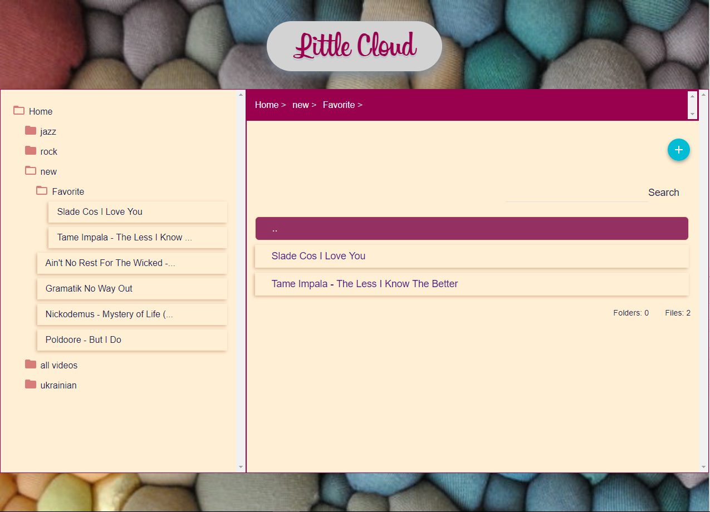
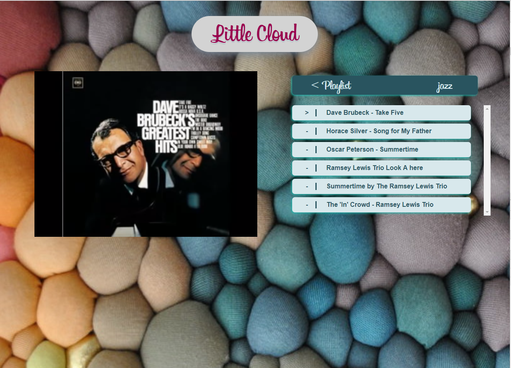
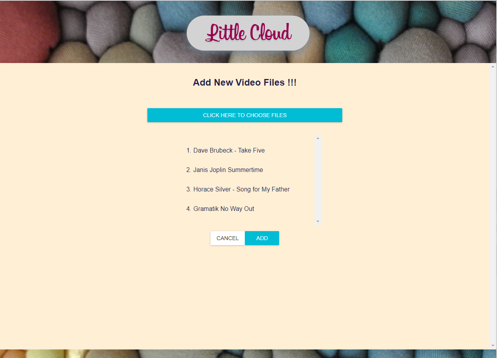
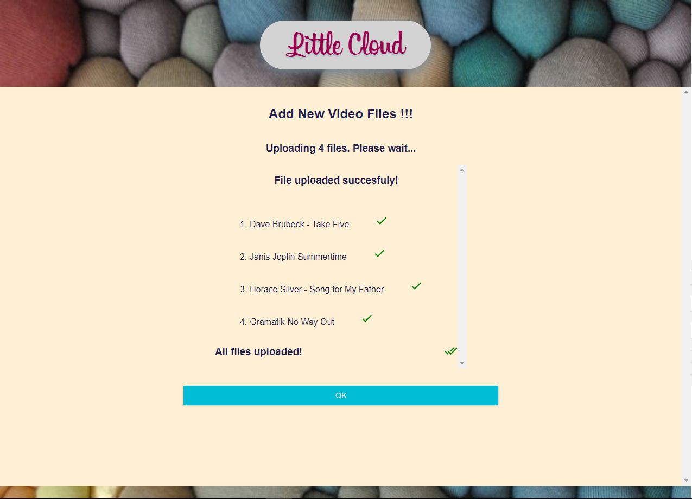
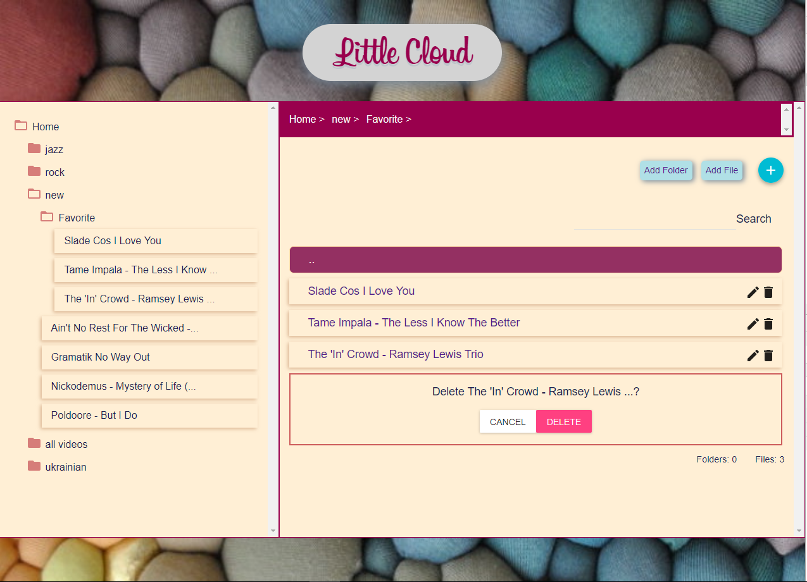
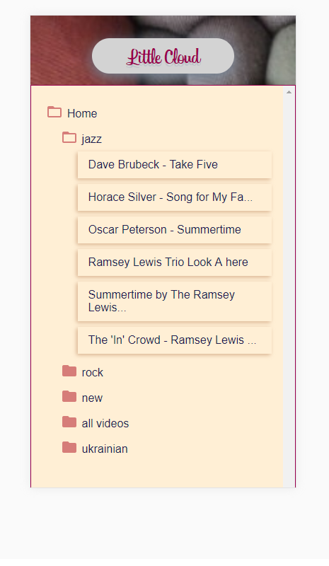
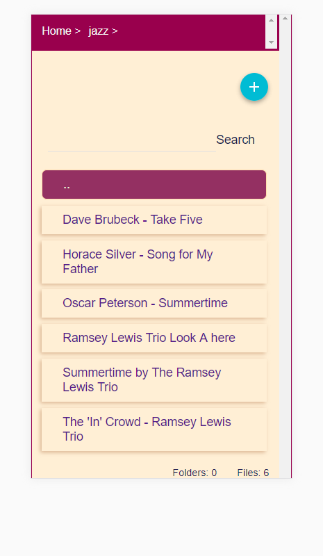
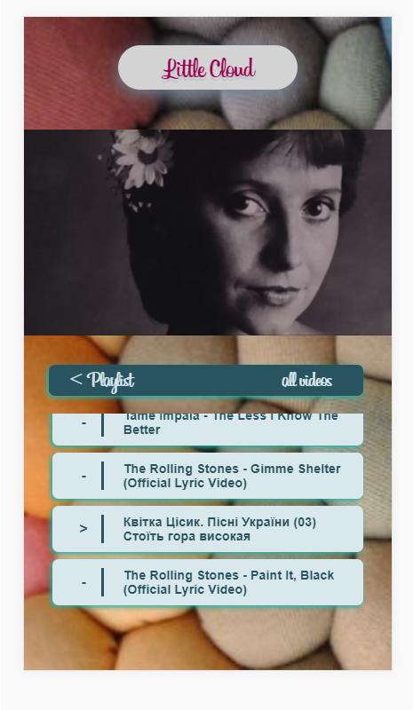
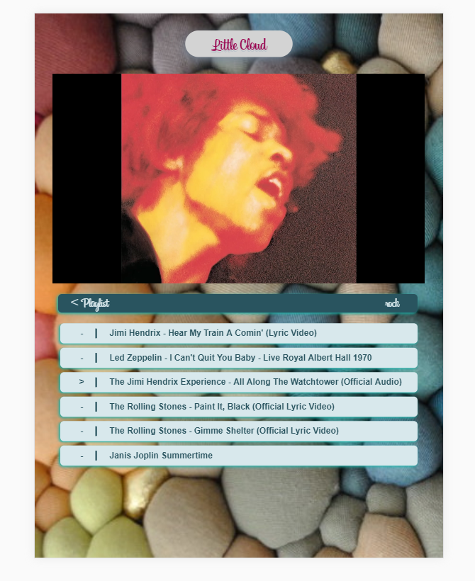

# Little Cloud

Simple App that allows to upload video files and store them in MongoDB using GridFS. Files organized as folders tree structure. 

---

MERN stack (MongoDB, Express, React, Node). 

* There are two separate servers for the backend and the front-end. 
* Front-end server created with create-react-app.

Also are used 
* Redux 
* React Router 4 
* Material-UI
* Material-Icons
* Flexbox
---

## To make it work on your local machine:

1. You should have MongoDB service started on port 27017

2. Open new CMD. Navigate to backend folder and run commands:
      #### `npm install` or `yarn install` 
      #### `npm start` or `yarn start`
    This will start backend server on port 8080 and will establish the connection to MongoDB
    
    
3. Open new CMD. Navigate to frontend folder and run commands:
      #### `npm install` or `yarn install` 
      #### `npm start` or `yarn start`
    This will start front-end server on port 3000 New window in your browser will open automatically on localhost:300
    
---

Now you can see the Home folder. You can add folders and files, edit them or remove. 
Navigate over tree or tabs. View selected file in player. All files in the selected folder will be viewed as a playlist.
And it's all persistent because we are using MongoDB and GridFS.

---

